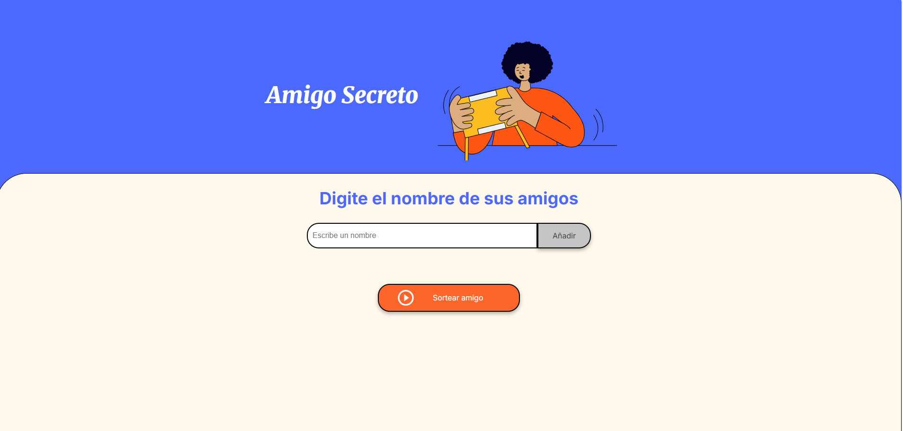

  

<h1 align="center"> Juego Amigo Secreto </h1>
*** 
Aplicación web sencilla que permite realizar sorteos tipo "amigo secreto". Ideal para fiestas, eventos familiares o para practicar lógica básica con JavaScript.

<h2 align="center">🧭 Índice</h2>

  <a href="#vista-previa">Vista previa</a> •
  <a href="#características"> Características</a> •
  <a href="#como-funciona">¿Cómo funciona?</a> •
  <a href="#tecnologias-usadas">Tecnologías usadas</a> •
  <a href="#objetivo"> Objetivo</a> •
  <a href="#futuras-mejoras"> Futuras mejoras</a> •
  <a href="#autor"> Autor</a>

##  Vista previa

  

## Características
- Agrega participantes a una lista.
- Evita duplicados.
- Sortea un nombre al azar.
- Validación básica de inputs.
- Interfaz amigable y funcional.

## ¿Cómo funciona?

1. Ingresa los nombres de todos tus amigos (mínimo 2)
2.  Cada nombre se añade a una lista visible.
3. Al presionar el botón **"Sortear amigo"**, se selecciona un participante al azar.

## Tecnologías usadas

- HTML5
- CSS (si aplica)
- JavaScript Vanilla (sin frameworks)

## Objetivo

Este proyecto fue desarrollado con fines didácticos y forma parte de mi portafolio personal. Está pensado para practicar manejo de arrays, interacción con el DOM y lógica básica de sorteo.

## Futuras mejoras
- Permitir sortear a todos los participantes (como un verdadero "amigo secreto").
- Evitar que alguien se asigne a sí mismo.
- Estilo responsive con CSS o Tailwind.
- Exportar resultados en PDF o enviarlos por correo.

## Autor
Desarrollado en base al curso de Oracle, Allura Latam, por la estudiante [Daniella Cedeño Arias](https://github.com/dacerioas)